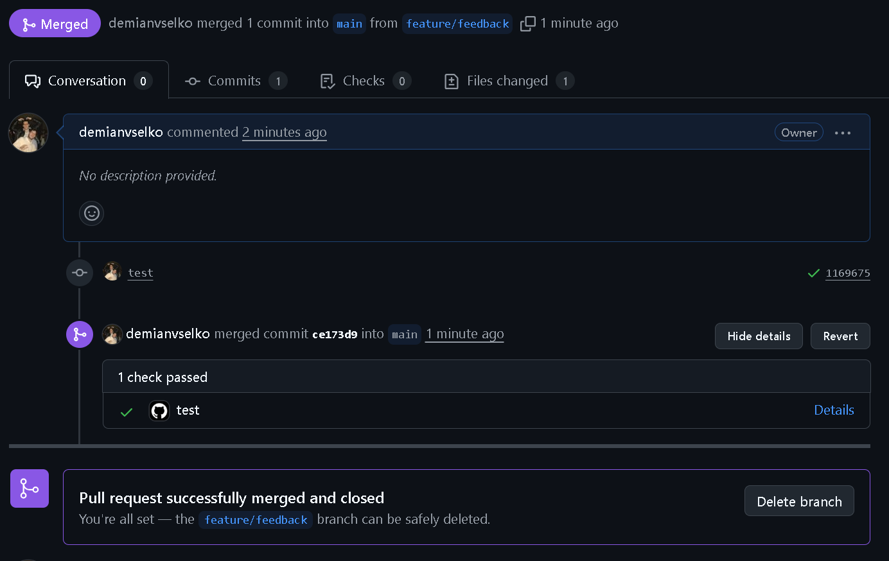

Interbanking Challenger
🚀 Project setup
  npm install

▶️ Run the project

# development

  npm run start

# watch mode

  npm run start:dev

🧪 Run tests

# unit tests (92% coverage)

  npm run test

# e2e tests (52% coverage)

  npm run test:e2e

🔑 Authentication

Para testear los endpoints:
  Obtener un token JWT en el endpoint de login.
  Usar ese token como Bearer Token en la cabecera Authorization de las requests.

📌 Decisiones:
Al hacer el npm i, la base de datos se creara sola y se populara.
Si deciden cambiar el repositorio para usar Json, este tambien se cargara automaticamente al levantar el servidor, para poder tener datos de pruebas.

Transferencias
  No pueden ser negativas.
  Se pueden programar a futuro.

Entidades
  Modeladas para asemejarse a escenarios reales.
  La fecha de adhesión se asigna automáticamente al crear la empresa.

Búsqueda por fechas (todas se manejaran con el huso horario de UTF-0, ya que me parece lo mas conveniente a la hora de manejar las fechas):
  Endpoint genérico con parámetros de rango de fechas.
  Por defecto trae el último mes, pero puede personalizarse.

Company ID
  No se usa el CUIT como identificador único.
  Esto evita problemas en casos donde una empresa cambia de CUIT sin cambiar razón social (situación real que suele causar errores en producción).

Entiendo que esto cubre los detalles que me han pedido, antes cualquier dudas sobre el codigo podemos hablar por meet.

 Si necesitan mas cambios, pueden solicitarlos.

CURLS para pruebas:

❤️ Healthcheck
curl -X GET <http://localhost:3000/health>

🔑 Login (obtener JWT)
  curl -X POST '<http://localhost:3000/auth/login>' \
    -H 'Content-Type: application/json' \
    -d '{
      "username": "hackme",
      "password": "please"
    }'

📅 Obtener adhesiones (GET /companies/adhesion)

curl -X GET <http://localhost:3000/companies/adhesion> \
  -H "Authorization: Bearer TOKEN"

💸 Obtener transferencias (GET /companies/transfers)

curl -X GET "<http://localhost:3000/companies/transfers>" \
  -H "Authorization: Bearer TOKEN"

💸 Obtener transferencias con filtro de fechas(GET /companies/transfers)

curl -X GET "<http://localhost:3000/companies/transfers?from=2025-08-01&to=2025-09-01>" \
  -H "Authorization: Bearer TOKEN"

🏢 Crear Company

curl -X POST <http://localhost:3000/companies> \
  -H "Content-Type: application/json" \
  -H "Authorization: Bearer TOKEN" \
  -d '{
    "cuit": "12345678901",
    "name": "Empresa Test",
    "type": "PYME"
  }'

Lambda:

Se debe exponer la lambda a traves de apigateway desplegando el serverless.yml, en donde tengo declarados los recursos.
La lambda tiene una layer, aunque no es necesaria para este caso, ya que es una sola.
La peticion llegaria a traves de AG en el event, luego pasrseo el body, aplico la logica de lambda (invoca al casod e uso correspondiente) y retorno la respuesta.

Tambien podria desplegarse con CKD.

Request:
{
  "cuit": "20304050601",
  "name": "Mi Empresa S.A.",
  "type": "PYME",
  "accounts": ["1234567890", "987654321012345"]
}

Response 201:
{
  "id": "7d6f5a54-6c4a-4d0b-97c8-8e70a84a11c3",
  "cuit": "20304050601",
  "name": "Mi Empresa S.A.",
  "dateOfAddition": "2025-09-11T09:55:00.000Z",
  "type": "PYME",
  "accounts": ["1234567890", "987654321012345"]
}

Response 400
{
  "error": "CUIT must have exactly 11 digits" (o el mensaje de la falla)
}

Response 500:
{
  "error": "Unknown error"
}
